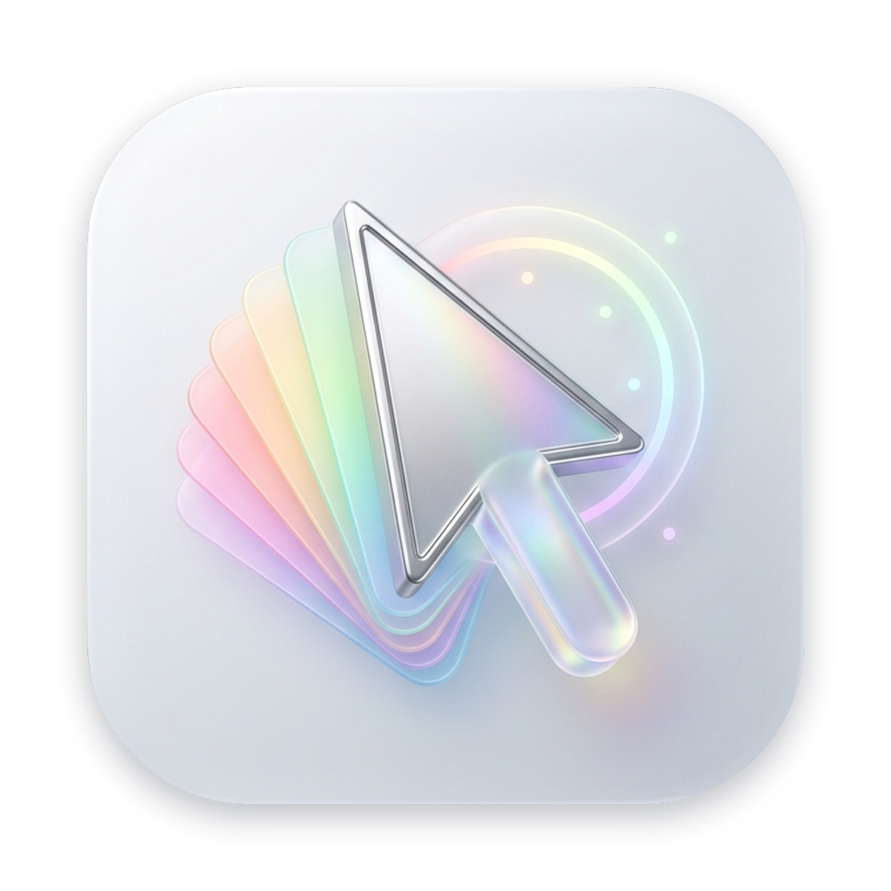

# WinToMacCursor 🖱️✨

<p align="center">
  
</p>

<p align="center">
  <b>将 Windows 鼠标光标（.cur / .ani）一键转换为 macOS 原生主题，支持动画回放、菜单栏快速切换与会话级系统更换</b>
</p>

<p align="center">
  <a href="README.md">English</a> | <b>简体中文</b>
</p>

---

## ✨ 核心特性

- 📥 **全面的 Windows 光标解析**：原生支持静态 `.cur`、动态 `.ani`（RIFF/ACON 格式，多帧精准解码）与 `install.inf` 方案配置文件。
- 📦 **macOS 标准 `.cape` 主题导出**：全自动合成 Retina 视网膜级 1x 与 2x 垂直雪碧图（Vertical Sprite Sheet），符合 Mousecape 规范。
- 🎬 **实时动画预览器**：逐帧高精度回放（支持 0.25x ~ 3x 倍速调节、逐帧步进、热点红十字准星指示）。
- 🎯 **鼠标试用画板 (Cursor Playground)**：互动体验区，鼠标滑入即时动态切换为光标动画，支持点击波纹与定位手感反馈。
- ⚡ **一键更换系统光标 (Apply)**：基于 macOS 底层 SkyLight CGS 私有 API，即时在系统会话中全局生效，免第三方依赖。
- 🚀 **顶部菜单栏极速切换 (Status Bar)**：常驻 macOS 菜单栏，点击即可在所有导入的鼠标方案之间秒级切换，支持一键还原。
- ↺ **正版原生光标一键恢复 (Restore)**：内置 Apple 原生全套 21 项系统光标资产（`DefaultMacCursor.cape`），安全可靠，一键瞬时还原正统苹果默认指针。
- 🌐 **多语言国际化 (i18n)**：支持 English 与 简体中文，随 macOS 系统语言自动适应，亦支持在 App 内自由切换。
- ⚙️ **macOS 原生设置面板与程序坞控制**：支持通过 `Cmd+,` 打开原生设置面板，提供多语言切换、退出行为偏好，并支持隐藏 Dock 图标仅在菜单栏常驻运行。
- 💾 **方案库本地持久化**：支持自由导入外部方案包与光标文件，数据持久保存于应用支持库中。

---

## 🛠️ 构建与运行

### 系统要求
- macOS 13.0 (Ventura) 及更高版本
- Xcode Command Line Tools (`swiftc`)

### 本地编译
克隆本仓库后，直接运行内置构建脚本：
```bash
bash scripts/build_app.sh
```
构建产物将输出在 `dist/WinToMacCursor.app`。

运行应用：
```bash
open "dist/WinToMacCursor.app"
```

---

## 📄 许可证

MIT License.
